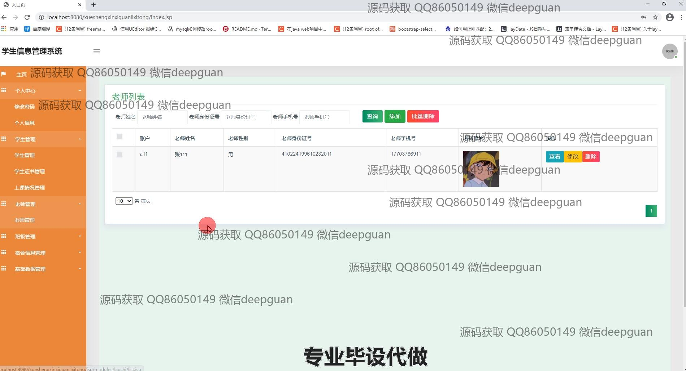
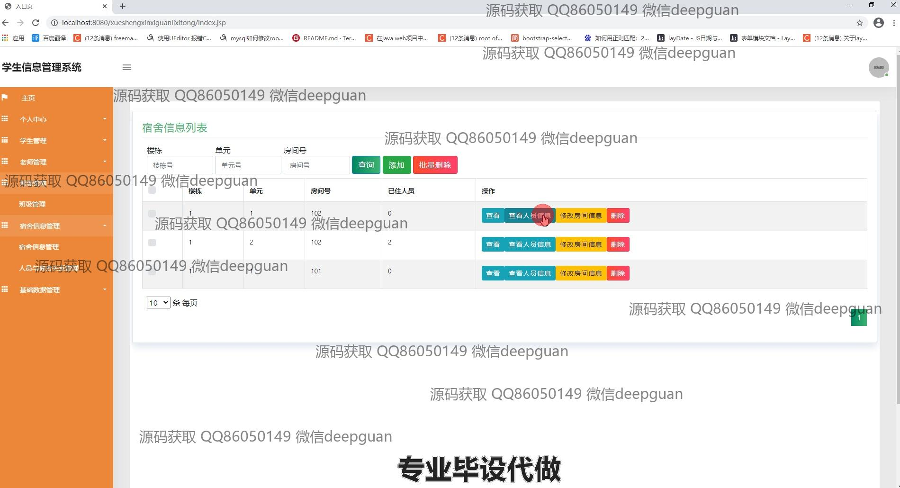
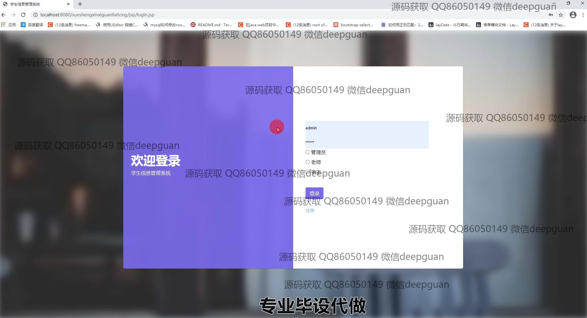
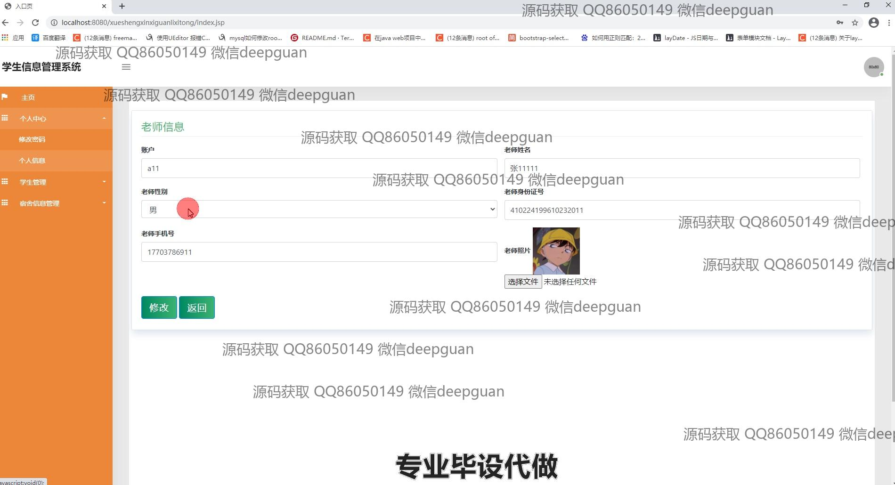
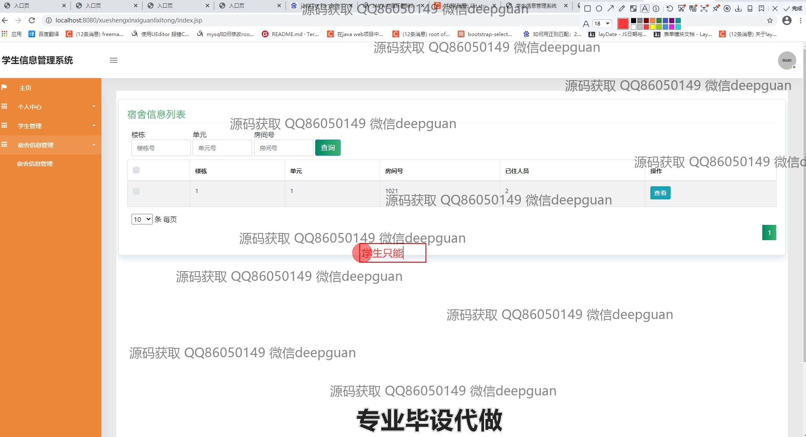

<h1 align="center">工贸学生信息管理系统</h1>

## 简介
工贸学生信息管理系统：角色分为管理员、教师和学生，功能包括学生管理、教师管理、班级管理、宿舍信息管理及上课情况管理，支持学生信息录入、查询、修改及数据统计分析。    --计算机毕业设计源码；毕设源码；java毕业设计源码

## 联系方式

<h3 align="center">获取完整代码与数据库文件 + 微信：deepguan QQ: 86050149 QQ群: 783742310</h3>

<h3 align="center">可帮忙远程部署 包运行成功！提供远程部署、修改代码、设计文档指导、代码讲解等服务！</h3>

## 功能介绍（完整见运行截图）
管理员：管理员可以通过系统登录界面选择身份进行登录，并访问各个管理模块，如学生管理、教师管理、班级管理和宿舍信息管理等。管理员可以对学生及教师的信息进行录入、查询、修改和删除操作。系统还提供数据统计功能，管理员可以分析学生的学习情况，管理上课情况，处理人员与宿舍关系等。管理员可查看和审核各类信息，确保数据的完整性和准确性，同时可以通过搜索和批量操作提高工作效率。

老师：老师在系统中可以查看、录入和管理学生的基本信息和上课情况。通过系统，老师可以快速检索学生的详细信息，包括姓名、学号、性别及联系方式等，还可查看学生的成绩和课程安排。系统支持管理和录入学生的证书信息，帮助老师高效地评估和跟进学生的学习进度。同时，老师还可以访问宿舍管理模块，了解学生宿舍分配情况和人员变动，以便于开展管理工作。

学生：学生用户可以通过系统登录界面进入个人中心，查看和修改个人信息。系统允许学生查看自己的成绩和上课安排，并可存取与自身相关的证书信息。学生还可以通过系统查询宿舍的分配情况和当前居住人员的信息。系统设计为学生提供了简洁易懂的操作界面，使学生可以方便地访问和管理自己的数据，从而提高信息透明度和参与感。

宿舍管理员：宿舍管理员在系统中可以管理宿舍的信息列表，包括楼栋、单元、房间号及已住人员数量。系统提供搜索、添加、删除和修改房间信息的功能，方便宿舍管理员进行高效的宿舍资源分配和管理操作。管理员可以通过人员与宿舍关系管理模块查看人员的详细信息并进行相应的调整，确保宿舍安排的合理性和有序性。

## 运行截图

本代码来源于网络,仅供学习参考使用!

